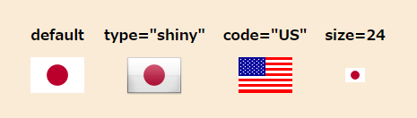

# Countory Flag



<div align="center">Github repository containing the source code for Countory Flag Component</div>

<p align="center">

<a href="https://twitter.com/pg_maaaashi" rel="nofollow">
  
</a>

# Table of Contents

- [Countory Flag](#countory-flag)
- [Table of Contents](#table-of-contents)
- [Usage](#usage)
  - [script src](#script-src)
  - [npm](#npm)

# Usage

```html
<!-- 日本の国旗 -->
<countory-flag></countory-flag>
<!-- 艶やかなデザインに -->
<countory-flag type="shiny"></countory-flag>
<!-- アメリカの国旗 -->
<countory-flag code="US"></countory-flag>
<!-- 24pxで表示 -->
<countory-flag size=24></countory-flag>
```

## script src

```html
<head>
  <script src="https://maaaashi.github.io/countory-flag/bundle.js"></script>
</head>
<body>
  <countory-flag></countory-flag>
</body>
```

## npm

```
$ npm install @maaaashi/countory-flag
```

```jsx
import '@maaaashi/countory-flag'

<countory-flag></countory-flag>
```